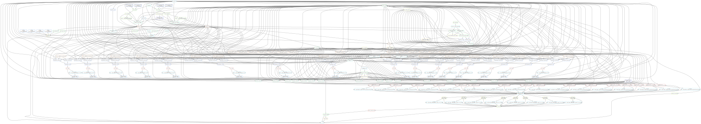

# 流程说明
此流程仅用于WGS\WES\PANEL的DNA测序数据分析。

## 流程图示例

## 流程环境
``conda activate /public/home/weiyifan/miniforge3/envs/sk8``
## 流程部署
``snakedeploy deploy-workflow https://github.com/joyling93/dna-seq-varlociraptor . --tag v1.1.0``
## 配置信息
### 必填
config.yaml  
samples.yaml  
units.yaml  
scenario.yaml  
### 选填
primers.tsv  
super_insteresting_genes.tsv  
## 流程运行
``snakemake -c30 --use-conda --cache``

# 样本配置
要配置此工作流，请根据你的需求修改“config/config.yaml”，并遵循文件中提供的说明。

将样本添加到“config/samples.tsv”中。对于每个样本，必须定义“sample_name”、“alias”、“platform”、“datatype”、“calling”和“group”列。
  - 同一“group”中的样本可以通过它们的“alias”在联合[call 突变场景](#calling-scenario)中被引用。
  - “alias”表示样本在其组中的名称。它们旨在作为样本类型的一些抽象描述，用于[call 突变场景](#calling-scenario)，因此应在不同组中一致使用。一个典型的例子是“tumor”和“normal”别名的组合。
  - “platform”列需要包含使用的测序平台（“CAPILLARY”、“LS454”、“ILLUMINA”、“SOLID”、“HELICOS”、“IONTORRENT”、“ONT”、“PACBIO”之一）。
  - 在使用默认场景时需要纯度列。如果未知，可以设置为“1.0”。
  - 在“samples.tsv”样本表中，相同的“sample_name”条目可以多次使用，只有重复行之间“group”列的值不同。这样，你可以在不同的组中使用相同的样本 call 突变，例如，当你没有匹配的正常样本用于肿瘤call 突变时，可以使用一组正常样本。
  - “datatype”列指定每个样本对应的数据类型。可以是“rna”或“dna”。
  - “calling”列设置要执行的分析类型。可以是“fusions”、“variants”或两者（用逗号分隔）。
如果要估计样本的突变负荷，则必须在一个额外的列“mutational_burden_events”中指定来自call 突变场景的要使用的“事件”（见下文）。该列中的多个事件必须用逗号分隔。
缺失值可以通过空列或写入“NA”来指定。行可以用“#”注释掉。

## 单元表
对于每个样本，将一个或多个测序单元（运行、分组或重复）添加到单元表“config/units.tsv”中。
  - 每个单元有一个“unit_name”。这可以是一个连续的编号，也可以是实际的运行、分组或重复 ID。
  - 每个单元有一个“sample_name”，它将单元与它来自的生物样本相关联。此信息用于在读取映射和重复标记之前合并样本的所有单元。
  - 对于每个单元，你需要指定以下列中的一个：
    - 仅对于单端读取指定“fq1”。这可以指向系统上的任何 FASTQ 文件。
    - 对于成对末端读取指定“fq1”和“fq2”。这些可以指向系统上的任何 FASTQ 文件。
    - 仅指定“sra”：指定一个 SRA（序列读取档案）登录号（例如以 ERR 或 SRR 开头）。管道将自动从 SRA 下载相应的成对末端读取。
    - 如果本地文件（“fq1”、“fq2”）和 SRA 登录号（“sra”）都可用，则使用本地文件。
  - 在“adapters”列中定义适配器，将[cutadapt 参数](https://cutadapt.readthedocs.org)放在引号中（例如“-a ACGCGATCG -A GCTAGCGTACT”）。
缺失值可以通过空列或写入“NA”来指定。行可以用“#”注释掉。

## 引物修剪
当启用引物修剪时，引物必须直接在“config.yaml”中或在单独的 tsv 文件中定义。
当所有样本来自同一引物组时，首选在配置文件中直接定义引物。
对于不同的pannel，引物必须在单独的 tsv 文件中按设置。
对于每个pannel，需要设置以下列：“panel”、“fa1”和“fa2”（可选）。
此外，对于每个样本，相应的pannel必须在“samples.tsv”中定义（“panel”列）。
仅对于单引物修剪，必须定义配置（或相应的 tsv 文件）中的第一个条目。

# 参数配置
ref:  # 参考基因组配置
  n_chromosomes: 25   # 基因组包含的染色体数量  
  species: homo_sapiens    # Ensembl species name  
  release: 109    # Ensembl release  
  build: GRCh38    # Genome build  

primers:  # 接头配置  
  trimming:  
    activate: false  
    primers_fa1: "path/to/primer-fa1"     # path to fasta files containg primer  sequences    
    primers_fa2: "path/to/primer-fa2"    
    library_error: 0  # 测序错误率，填 0 表示流程自动配置   
    library_length: 0  # 插入序列长度，填 0 表示流程自动配置  

mutational_burden: #  突变负荷配置  
  activate: true  
  coding_genome_size: 3e7 # 突变负荷估计中测序编码基因的大小  
  mode:  # Plotting modes  
    - hist
    - curve
  events:# 画图时包含的突变事件  

mutational_signatures: # 暂时未使用，未来考虑删除  
  activate: false  
  events:  

tables: # 突变总结表格表头设置  
  activate: true  
  output:  
    expression: "INDEX, CHROM, POS, REF"   
    genotype: true  
    coverage: true  
    event_prob: true  
  generate_excel: false # 暂未使用，未来考虑删除    

calling:  # 变异定义配置  
  infer_genotypes: true  
  delly:  # 是否使用delly算法  
  freebayes:  # 是否使用freebayes算法  
  scenario: config/scenario.yaml  
  filter: # 过滤需要报告的突变类型  
    candidates: "ANN['IMPACT'] != 'LOW'"  
  fdr-control:  
    threshold: 0.05 # 阈值过滤   
    local: true  
    events: # 过滤需要报告的突变事件  

remove_duplicates:# 是否过滤重复比对  

calc_consensus_reads: # 是否计算并过滤pcr重复  

annotations: #突变注释配置  
  vcfs:  
    activate: true  
    known: resources/variation.vcf.gz #指定vcf文件，用于注释已知突变，会自动设置，不要修改  
  dgidb: #疾病注释   
    datasources:  
      - DrugBank  
  vep: # vep相关参数
    candidate_calls:  
      params: --af_gnomade  
      plugins: []  
    final_calls:
      params: --everything --check_existing  #vep注释的突变类型  
      plugins: # vep 插件  

params:# 其他可修改的流程参数  
  cutadapt: ""  
  picard:  
    MarkDuplicates: "--VALIDATION_STRINGENCY LENIENT"  
  gatk:  
    BaseRecalibrator: ""  
    applyBQSR: ""  
  varlociraptor:  
    call: ""  
    preprocess: "--max-depth 300"  
  freebayes:  
    min_alternate_fraction: 0.05 # Reduce for calling variants with lower VAFs  

msisensor: # 微卫星突变检测  
  normal: SRR23800298 # 指定正常样本  
  tumor: SRR23800299 # 指定肿瘤样本  

driver_gene: # 驱动基因检测   

purity_ploidy:  # 纯度计算  
  normal: SRR23800298 # 指定正常样本  
  tumor: SRR23800299 # 指定肿瘤样本  

# 突变定义
Varlociraptor 支持对任意场景的变异进行集成的不确定性感知call 突变和过滤。这些被定义为所谓的场景，通过[变异call 突变语法](https://varlociraptor.github.io/docs/calling#generic-variant-calling)。
  - [scenario.yaml 模板参考](https://varlociraptor.github.io/varlociraptor-scenarios/landing/)
  - [格式说明](https://varlociraptor.github.io/docs/calling/)
